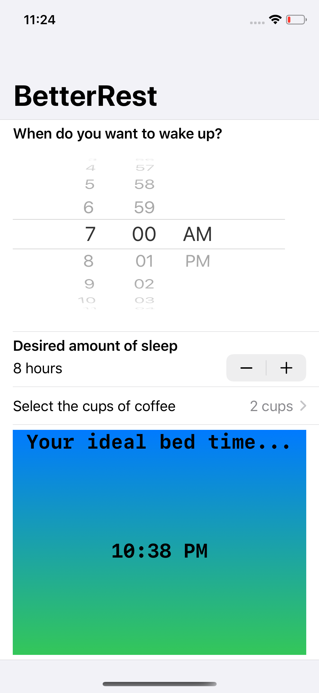

<h1> Day 25, 26 of 100 Days of SwiftUI </h1>

 This is the app that will help you calculate depending on the desired hours of sleep and the amount of coffee.
This project has a built in Machine Learning project that helps with the calculation and preditation. 

 
  Challenges to complete in this part 3 of project 4...
  <ol> 
    <li> Replace each VStack in our form with a Section, where the text view is the title of the section. Do you prefer this layout or the VStack layout? It’s your app – you choose!</li>
    <li>Replace the “Number of cups” stepper with a Picker showing the same range of values. </li>
    <li>Change the user interface so that it always shows their recommended bedtime using a nice and large font. You should be able to remove the “Calculate” button entirely. </li>
   </ol>
   

Screenshot of the app...

